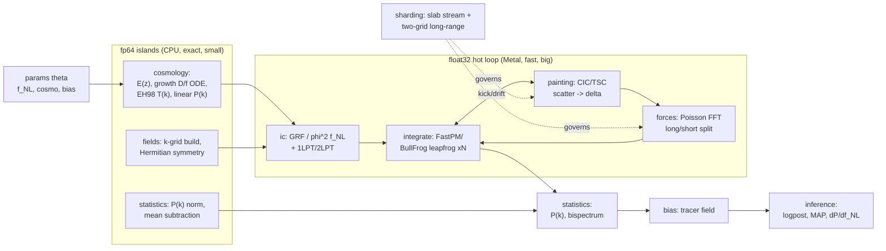
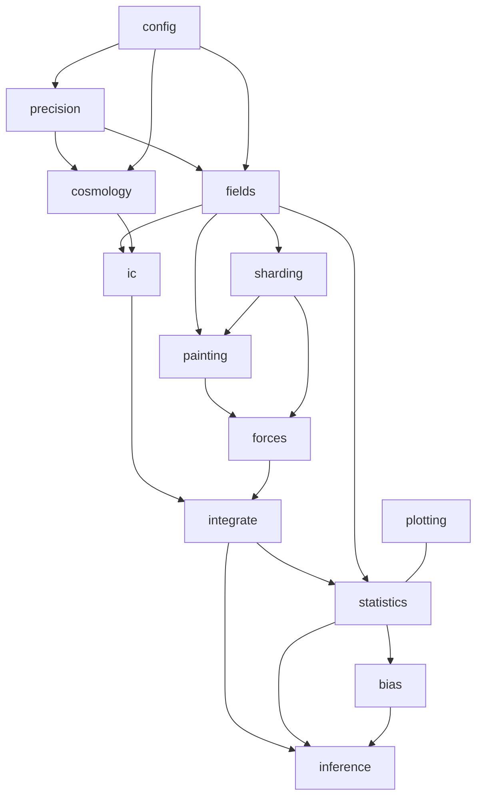

# M-body: extensive architecture for a Mac-native differentiable MLX PM N-body

## Context

M-body today is a one-commit scaffold: README, ROADMAP (6 linear steps), a
single FFT-autodiff probe (`scripts/probe_ad_fft.py`), smoke tests, and the
pixi/MLX wiring. The user wants to graduate this into an **extensive,
literature-grounded architecture** for a differentiable particle-mesh N-body on
Apple Silicon, built to be a *learning vehicle* for the N-body landscape as much
as a research toy. The ultimate target is **field-level inference of local
`f_NL`** and the **galaxy-bias / `b_phi` lever** that dominates the SPHEREx
`f_NL` systematic, with general cosmology exploration along the way.

This PR delivers the **architecture documents + a typed module skeleton** (the
user's chosen scope). It does not implement physics; it lays rails that encode
the design decisions so the staged build has a spine. Two user steers shape it:
(1) bias expansion is the near-term galaxy-formation lever, with a simplified
differentiable-baryon module as an explicit *later* phase; (2) the
large-scale-preserving **sharding/streaming is near-term**, so the field/mesh
abstractions are slab-aware from day one rather than retrofitted.

### Research that grounds the design (done during planning)

- **MLX float64 is GPU-unsupported.** Metal runs float32 only; float64 arrays
  execute on CPU and silently downcast on GPU ([mlx#799], [mlx#1905]). This is
  the single most architecture-determining fact: the fp64 "fallback" is a
  *CPU island*, not a GPU dtype switch.
- **pmwd** ([2211.09958]) solves the unrolled-graph memory blowup with the
  **adjoint method + reverse-time integration** (reconstruct state backward,
  store O(1) snapshots) -- the memory endgame.
- **FastPM** ([1603.00476]) uses **modified kick/drift kernels + a broadband
  correction** that enforce correct linear growth on the largest scales at low
  step count -- directly serves "preserve the largest scales."
- **DISCO-DJ II** ([2510.05206], JAX) is the closest architectural cousin:
  modular Boltzmann + PM, **BullFrog/FastPM** integrators, and discreteness
  suppression (de-aliasing, higher-order mass assignment, interlacing).
- **MLX has what we need for AD memory + custom rules**: real FFTs
  (`rfftn`/`irfftn`, last axis size `N//2+1`), `mx.checkpoint`
  (rematerialization), and `@mx.custom_function` with
  `.vjp(primals, cotangent, output)` (for an adjoint stepper / custom FFT VJP).
- **Science targets**: `b_phi` non-universality (Barreira, [2006.09368],
  [2107.06887]) is the dominant `f_NL` systematic; field-level `f_NL` inference
  (Andrews et al. [2203.08838]; Euclid [2412.11945]; Quijote [2603.20855])
  gives ~1.3x over P+B and is the inference endgame.

## What this PR builds

```
docs/ARCHITECTURE.md     extensive design (this plan, expanded into prose)
docs/DECISIONS.md        decision log + literature map (the "why" / landscape)
ROADMAP.md               rewritten: phased plan (replaces the 6-step version)

mbody/config.py          typed dataclasses (FULLY implemented -- pure data)
mbody/precision.py       dtype policy + CPU-fp64 island + compensated sums
                         (implemented enough to be import/unit-testable)
mbody/cosmology.py       background + EH98 transfer + linear P(k)   [stub]
mbody/fields.py          RealField/FourierField, k-grid, GRF, shards [stub]
mbody/ic.py              Gaussian + local-f_NL ICs, 1LPT/2LPT        [stub]
mbody/painting.py        CIC/TSC/PCS scatter-paint + gather-read     [stub]
mbody/forces.py          Poisson solve, force kernels, long/short    [stub]
mbody/integrate.py       Integrator iface, FastPM/BullFrog, driver   [stub]
mbody/sharding.py        SlabDecomp, slab streaming, two-grid force  [stub]
mbody/statistics.py      P(k), cross-corr, squeezed bispectrum       [stub]
mbody/bias.py            Lagrangian/Eulerian bias, b1/b2/b_phi        [stub]
mbody/inference.py       forward-model posterior, MAP, HMC, dP/df_NL  [stub]
mbody/plotting.py        slice + P(k) figures -> outputs/             [stub]
mbody/__init__.py        public surface exports

scripts/probe_ad_fft.py  EXTEND: add rfftn/irfftn, scatter/gather,
                         checkpoint, custom_function VJP, fp32-vs-fp64 checks
tests/test_*.py          import/skeleton tests + precision unit tests
```

"[stub]" = typed signatures + rich docstrings (the contract: inputs, dtype/
device policy, shapes, what it validates against) + `raise NotImplementedError`.
No `pyproject.toml`/`pixi.lock` changes (cannot regenerate the osx-arm64 lock on
this Linux container), so **no new pixi tasks or deps** -- the extended probe
runs under the existing `probe` task; physics deps already present.

## Architecture: forward-model dataflow

Precision is annotated: **[64/CPU]** = fp64 island on CPU (small, cheap, exact);
**[32/GPU]** = float32 hot loop on Metal. Gradients (`mx.grad`) flow right-to-
left back to `theta = {f_NL, cosmology, bias}`.



## Architecture: module dependency graph



Layering rule (enforced by imports): `config` and `precision` are leaves
everyone depends on; nothing imports `inference` except scripts; `sharding` is a
cross-cutting service that `painting`/`forces` consult but that itself only
depends on `fields`.

## Key technical decisions

### 1. Precision policy (`mbody/precision.py`) -- load-bearing

Because Metal is float32-only, fp64 cannot be a global switch. The policy:

- `REAL = mx.float32`, `COMPLEX = mx.complex64` are the GPU defaults; the whole
  PM hot loop (paint, FFT force, gather, kick/drift) stays here.
- `fp64_cpu()` context manager wrapping `with mx.stream(mx.cpu):` plus
  `.astype(mx.float64)` for the **fp64 islands**: growth-factor ODE, EH98
  tabulation, k-grid coordinate construction, P(k) normalization, and
  large-volume mean subtraction. These are small arrays -- cost is negligible,
  correctness is not.
- `compensated_sum(x)` (Kahan/Neumaier or pairwise) for global float32
  reductions that must happen on-device (variance of near-equal large sums is
  the classic fp32 failure; `<phi_G^2>` in f_NL ICs and P(k) shot-noise
  subtraction are exactly this).
- Documented `double_single` (two-float32) escape hatch for k-coordinates if a
  large box x fine mesh loses integer-index precision in fp32 -- noted in
  DECISIONS, not implemented now.
- A test asserts the fp64 island actually runs in fp64 (CPU) and that a chosen
  reduction is stable vs a naive fp32 sum.

### 2. Autodiff memory -- three tiers (the unrolled-graph problem)

Reverse-mode memory scales as (grid) x (steps). Tiered, selectable via
`PMConfig.memory_mode`:

| tier | mechanism | when |
|------|-----------|------|
| `replay` | plain reverse-mode through unrolled graph | few steps, modest grid (128 GB is generous) |
| `checkpoint` | `mx.checkpoint` per leapfrog step (recompute in backward) | more steps / bigger grid |
| `adjoint` | reversible integrator + reverse-time reconstruction via `@mx.custom_function` VJP, O(1) snapshots | memory endgame, pmwd-style |

`adjoint` requires a **reversible** integrator -- which FastPM KDK and BullFrog
both are -- so the integrator interface carries a `reversible: bool` and the
adjoint tier asserts it. Tiers are introduced across phases (replay first,
adjoint last) but the interface admits all three from the start.

### 3. Large-scale preservation + sharding (`mbody/sharding.py`) -- near-term

The user's "maximally preserve the largest scales" maps to a **long/short force
split**:

- **Coarse global grid** carries the long-range force: it is small, holds the
  largest scales, and its Poisson FFT can even run fp64-on-CPU for an exact
  large-scale potential. This is the scale-preserving core.
- **Fine grid, slab-streamed**, carries short-range force via a compact
  real-space kernel (overlap-add over slabs) -- a two-level PM (a.k.a.
  supersampling / PM-PM split), tileable without a global fine FFT.
- **FastPM broadband correction** enforces linear growth on large scales at low
  step count; **interlacing + TSC/PCS** assignment suppress small-scale aliasing
  from leaking into large-scale P(k) (DISCO-DJ discreteness suppression).

`SlabDecomp` is a descriptor (`axis`, `n_slabs`, `halo_pad`) threaded through
`RealField`; `painting`/`forces` consult it. Because the user wants this
near-term, `RealField`/`FourierField` carry an optional shard descriptor in
their signatures *now* even though streaming lands in Phase 5.

### 4. Integrators (`mbody/integrate.py`)

Common `Integrator` interface exposing `kick_factor`/`drift_factor` callables +
`reversible`. Concrete: **FastPM** (modified kernels, correct 1LPT growth,
default) and **BullFrog** (2LPT-accurate, time-reversible -- best with the
adjoint tier). A `leapfrog(state, integrator, cfg)` driver runs KDK and dispatches
the memory tier.

### 5. Differentiability-critical primitives -- probe first (Phase 0)

Extend `scripts/probe_ad_fft.py` from the current 1D-FFT-only check to also
assert `mx.grad` flows cleanly (vs analytic / finite-difference) through:
`rfftn`/`irfftn` (nD real transforms used everywhere), **scatter-add** (CIC
paint) and **gather** (CIC read), `mx.checkpoint` (grad matches non-checkpointed),
and `@mx.custom_function` VJP round-trip. Plus an fp32-vs-CPU-fp64 gradient
spot-check. If any fails, that dictates a fallback (custom VJP, or JAX/pmwd) --
exactly the day-0 gate the ROADMAP intends.

## Staged roadmap (-> ROADMAP.md)

Each phase leaves a runnable `scripts/` entry, a test, and an explicit exit
criterion. Phases 0-4 are the spine; 5 is pulled early per the sharding steer.

| # | Phase | Exit criterion |
|---|-------|----------------|
| 0 | De-risk primitives (probe: rfftn, scatter/gather, checkpoint, custom VJP, fp32/64) | all green |
| 1 | Foundations: config, precision, cosmology background + EH98 + linear P(k) | D(z) matches known values; P(k) shape sane |
| 2 | Fields + Gaussian ICs: k-grid (fp64), Hermitian GRF, rfftn fields, P(k) estimator | measured P(k) recovers input to cosmic variance |
| 3 | LPT + particles: 1LPT/2LPT displacement, velocities | cross-corr with linear field; slice plots |
| 4 | PM core: CIC paint/read, Poisson force, FastPM leapfrog | late-time P(k) growth vs linear on large scales; visible cosmic web |
| 5 | **Sharding + scale preservation** (early): two-grid long/short, slab streaming, interlacing, broadband correction | large-scale P(k) preserved vs single-grid ref at a mesh beyond the naive fit; memory/throughput benchmark |
| 6 | local f_NL ICs: phi^2 field, squeezed bispectrum | injected f_NL recovered from bispectrum on large scales |
| 7 | **Headline**: autodiff dlnP/df_NL through full pipeline; overlay Dalal `~f_NL/k^2` | the "it works" figure; grad stable under checkpoint |
| 8 | Memory endgame: reversible-integrator adjoint via custom_function | many-step run in budget; grad matches `replay` |
| 9 | Bias + b_phi: Lagrangian/Eulerian expansion, scale-dependent bias on a tracer | `Delta b(k) ~ f_NL/k^2` recovered; b_phi response measured |
| 10 | Field-level inference: forward-model posterior, MAP IC reconstruction, HMC, autodiff Fisher with b_phi marginalization | recover injected f_NL; sigma(f_NL) with/without b_phi marg (SPHEREx lever in miniature) |
| 11 | (stretch) Differentiable baryons: two-fluid / effective-pressure / Jeans filtering | documented, first-class later phase |

Cross-cutting: validation vs pmwd/analytic limits; convergence studies (steps,
force res); keep CI green.

## Verification

This container is **Linux**; the repo is pinned `osx-arm64` and MLX is
Apple-Silicon-only, so `pixi`/MLX **cannot run here**. Split accordingly:

- **In-container (authoritative for this PR's static surface):**
  - `python -m py_compile mbody/*.py scripts/*.py tests/*.py` -- syntax.
  - `black --check --skip-string-normalization mbody scripts tests` and
    `flake8 mbody scripts tests` (pip-install the two tools if absent; they are
    pure-Python and platform-independent). Must be clean.
  - Confirm `docs/` mermaid blocks render and links resolve.
- **On the user's Mac (deferred, the real MLX gate):**
  - `pixi run probe` -- the extended Phase-0 primitive checks must PASS.
  - `pixi run test` -- skeleton import tests + precision unit tests green.
  - Skeleton stubs raise `NotImplementedError` (asserted by a test), so a green
    run means "rails are sound," not "physics works."

## Risks / open questions

- **AD through scatter-add** (CIC paint) is the gating unknown after FFT; if
  `mx.grad` does not flow through `mx.scatter`/`at[].add`, Phase 4 needs a
  `custom_function` VJP (paint and read are exact transposes -- a clean custom
  rule). Probed in Phase 0 before any commitment.
- **fp32 force accuracy.** If the float32 Poisson/force solve degrades
  large-scale growth, the coarse long-range grid moves to fp64-on-CPU (the
  sharding design already permits this).
- **Streaming vs a global FFT.** MLX FFT is single-device; "sharding" here is
  slab *streaming* + the two-grid split, not MPI. The long-range global FFT
  stays whole (it is small); only the fine short-range is tiled.
- **No CI for MLX on Linux**: physics validation lives on the Mac. The skeleton
  is structured so `config`/`precision` are importable without heavy physics,
  keeping as much as possible checkable in-container.

## Sources

- MLX float64: [mlx#799](https://github.com/ml-explore/mlx/issues/799),
  [mlx#1905](https://github.com/ml-explore/mlx/issues/1905)
- pmwd: [2211.09958](https://arxiv.org/abs/2211.09958)
- FastPM: [1603.00476](https://arxiv.org/abs/1603.00476)
- DISCO-DJ I/II: [2311.03291](https://arxiv.org/abs/2311.03291),
  [2510.05206](https://arxiv.org/abs/2510.05206)
- Dalal et al. 2008: [0710.4560](https://arxiv.org/abs/0710.4560)
- b_phi: [2006.09368](https://arxiv.org/abs/2006.09368),
  [2107.06887](https://arxiv.org/abs/2107.06887)
- Field-level f_NL: [2203.08838](https://arxiv.org/abs/2203.08838),
  [2412.11945](https://arxiv.org/abs/2412.11945),
  [2603.20855](https://arxiv.org/abs/2603.20855)
- SPHEREx: [2511.02985](https://arxiv.org/abs/2511.02985)

---

## Local verification (osx-arm64, M4 Max, MLX 0.31.2)

The plan above was generated on a Linux container that could not run MLX, so its
MLX-specific claims were asserted from GitHub issues rather than executed.
Verified locally on Apple Silicon. Results:

### Confirmed (plan correct)
- `rfftn` / `irfftn` exist; rfftn last axis is `N//2+1` (8 -> 5).
- AD through `rfftn` matches central finite differences, and AD through a full
  `rfftn -> irfftn` roundtrip (Poisson-solve-shaped) also matches FD. Real-FFT
  autodiff is sound.
- scatter-add via `mesh.at[idx].add(w)` ACCUMULATES on repeated indices (true
  scatter-add: mesh[3]=5 for two contributions) and is differentiable -- grad
  wrt painted weights is exact. This was the #1 post-FFT gating unknown ("AD
  through scatter-add"); it is RESOLVED. CIC paint is differentiable with the
  native op -- no custom VJP needed for the values path.
- gather (`mesh[idx]`) is differentiable with correct repeated-index
  accumulation.
- `mx.checkpoint` exists; grad is bit-identical to the non-checkpointed graph
  (0.0 diff). The `checkpoint` memory tier is viable as described.
- `@mx.custom_function` with `.vjp(primals, cotangent, output)` exists and works
  exactly as the adjoint-tier design assumes.
- CPU fp64 island works: true double under `with mx.stream(mx.cpu)`.
- `pixi run probe` PASS (AD-through-fft rel err 1.1e-07); `pixi run test` 3/3
  smoke tests pass.

### Corrections (only Apple Silicon could reveal these)
1. **fp64 on the GPU RAISES; it does not silently downcast.** The plan said
   "float64 arrays execute on CPU and silently downcast on GPU." Actual MLX
   0.31.2 behavior: constructing `mx.array(1.0, dtype=mx.float64)` keeps dtype
   float64 even with the gpu default device, and `mx.eval` of a bare fp64 array
   is fine, but any fp64 *operation* on the GPU raises
   `ValueError('float64 is not supported on the GPU')`. Under
   `with mx.stream(mx.cpu)` true fp64 arithmetic works. This STRENGTHENS the
   "fp64 = CPU island" decision and removes the silent-precision-loss risk: the
   failure is a loud, test-catchable crash. `precision.py` must keep fp64
   strictly inside CPU-stream islands and cast back to float32 before
   re-entering the GPU hot loop; a stray fp64-on-GPU op is an error, not a
   silent degrade.
2. **`mx.fft.irfftn` requires `axes=` whenever `s=` is passed.**
   `irfftn(F, s=(N,N,N))` raises
   `ValueError('[irfftn] axes should not be None if s is not None.')`; the
   correct call is `irfftn(F, s=(N,N,N), axes=(0,1,2))`. Bake this into the
   inverse-transform helper in `fields.py` / `forces.py` so it does not bite in
   Phase 2/4.
