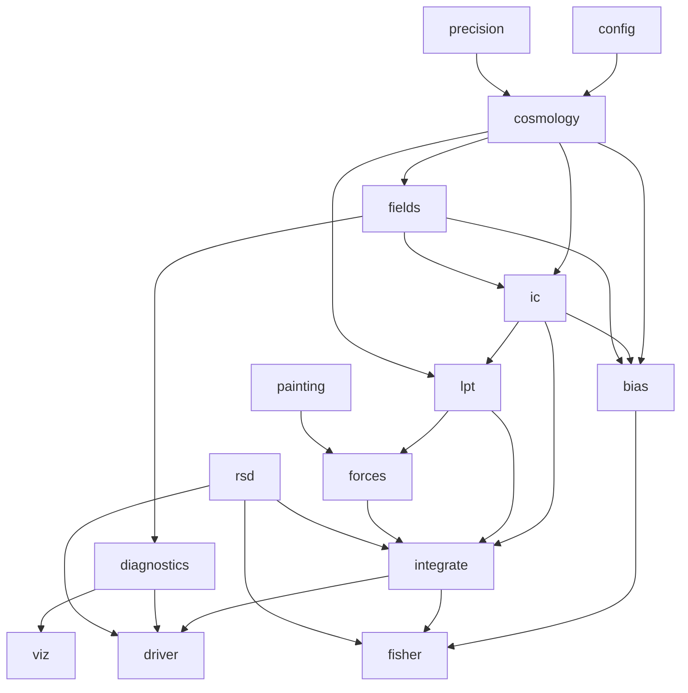
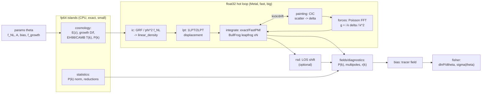

# M-body architecture (as built)

This describes the architecture of the package as it actually ships. For the
staged build history and per-step validation, see `ROADMAP.md`; for the
scientific motivation, see `README.md`.

## Context

M-body is a Mac-native, differentiable particle-mesh (PM) N-body toy built on
MLX. The forward model -- Gaussian or local-`f_NL` initial conditions, LPT
displacement, a handful of leapfrog PM steps -- is differentiable end to end, so
`mx.grad` yields gradients of summary statistics with respect to `f_NL` (and a
linear amplitude `A`, plus downstream bias / growth parameters). The headline is
autodiff `dlnP(k)/df_NL`; the deeper target is the galaxy-bias `b_phi` lever and
its degeneracy with `f_NL` (the dominant SPHEREx `f_NL` systematic), explored via
an autodiff Fisher forecast. It is an educational / intuition toy, not production
science.

## Module layout

```
mbody/
  config.py        typed dataclasses: SimConfig and its sub-configs
  precision.py     dtype policy: fp32 on the GPU, fp64 CPU-stream islands
  cosmology.py     background E(z), growth D(z)/f(z), CAMB + EH98 transfer, P(k)
  fields.py        GRF, k-grid, P(k) / cross-power, bispectrum, multipoles,
                   interlacing, the CIC window
  ic.py            Gaussian + local-f_NL ICs (phi^2 template), linear_density,
                   analytic local-bispectrum templates
  lpt.py           1LPT (Zel'dovich) + 2LPT displacement; the i k / k^2 kernel
  painting.py      CIC scatter-paint and gather-read (the trilinear adjoint)
  forces.py        FFT Poisson solve; geometric acceleration g = i k delta / k^2
  integrate.py     leapfrog steppers (exact / FastPM / BullFrog), the a-grid,
                   and the reversible adjoint (adjoint_grad_ic / _fnl)
  rsd.py           the redshift-space map (line-of-sight velocity shift)
  diagnostics.py   off-AD-path estimators + the memory-gated SnapshotRecorder
  driver.py        run(SimConfig) -> RunResult (the single forward entry point)
  bias.py          local quadratic-bias tracer + the Dalal/b_phi reference shapes
  fisher.py        the autodiff Fisher forecast (incl. RSD + multi-tracer)
  viz.py           the optional matplotlib layer (NOT imported by __init__)
```

There is no separate `statistics.py` / `inference.py` / `plotting.py` /
`sharding.py`: the statistics live in `fields.py` + `diagnostics.py`, the
forecast machinery in `fisher.py`, plotting in `viz.py` + the `scripts/plot_*`,
and sharding was never needed (the 128 GB unified-memory laptop holds the meshes;
the adjoint, not tiling, is the memory lever -- see below).

## Module dependency graph



`config` and `precision` are leaves everyone depends on; `viz` is imported only
lazily (inside `RunResult.dashboard` and the scripts), so `import mbody` stays
matplotlib-free and off the hot path.

## Forward-model dataflow

Precision annotated: **[64/CPU]** = fp64 island on CPU (small, exact);
**[32/GPU]** = float32 hot loop on Metal. Gradients (`mx.grad`, or the reversible
adjoint) flow right-to-left back to `theta = {f_NL, A, ...}`.



## Precision policy (`precision.py`)

Metal is float32-only and **fp64 on the GPU raises** (it does not silently
downcast -- see Local verification below). So fp64 is a deliberate CPU-stream
island, never a global switch:

- `REAL = float32` / `COMPLEX = complex64` for the whole PM hot loop.
- The fp64 islands -- the growth ODE/integral, EH98/CAMB tabulation, k-grid
  construction, P(k) normalization, and global reductions -- run under
  `with mx.stream(mx.cpu)` and cast back to float32 before re-entering the GPU.
- A stray fp64-on-GPU op is a loud, test-catchable crash, not a silent degrade.

## Autodiff memory: the reversible adjoint

Plain reverse-mode memory scales as (grid) x (steps). The realized solution is a
**reversible-leapfrog adjoint** (`integrate.adjoint_grad_ic`, and the
`adjoint_grad_fnl` wrapper): the KDK leapfrog (and the affine BullFrog DKD) is
time-reversible, so each state is reconstructed by reverse-stepping instead of
stored, giving memory flat in step count. It must run as an eager
`mx.vjp`-per-step with `mx.eval` each step (wrapping it in `mx.custom_function`
under an outer `mx.grad` re-defers it into one lazy graph and blows memory up), so
it is a dedicated entry point, not `mx.grad`-composable. Measured facts that
shaped this:

- `mx.checkpoint` of the force solve gives **no** peak-memory reduction here (the
  solve is near-linear, so reverse-mode retains almost nothing to recompute).
- `mx.compile` of the force solve is ~1x (FFT-bound).
- The one checkpoint that *does* pay is `recompute_cic` (wrap just the nonlinear
  CIC paint+read, recompute the stencil in backward) -- ~20% off, gradient exact.
- IC-stage parameters (`f_NL`, `A`) share ONE reverse sweep; downstream bias /
  `f_growth` parameters are cheap fixed-field `mx.grad`.

The earlier multi-tier (`replay` / `checkpoint` / `adjoint`) plan collapsed to:
replay for small jobs, the reversible adjoint for everything else.

## Integrators (`integrate.py`)

All three step KDK-style (FastPM/exact) or DKD (BullFrog) with background-only
kick/drift factors computed in the fp64 CPU island (so they are constants of the
step, off the AD graph):

- **exact** -- exact-background leapfrog; a low-step-count growth deficit.
- **fastpm** -- Feng+16 growth-corrected kernels; a single linear mode grows as
  `D(a)` exactly at any step count.
- **bullfrog** (default) -- Rampf+24 2LPT-accurate affine DKD; reuses the reversible
  adjoint (the affine kick is exactly invertible). Second-order accurate per step, so
  fewer steps at the default resolution; its advantage is resolution-gated and holds
  at `n_mesh >= 64`.

## Statistics, bias, RSD, and the Fisher

- `fields.py` / `diagnostics.py`: differentiable band powers + a Scoccimarro FFT
  bispectrum (the AD-path estimators), and off-AD-path `cross_correlation` /
  `particle_power` / growth / skewness + the `SnapshotRecorder`.
- `bias.py`: the Eulerian local quadratic-bias tracer
  `delta_h = b1 delta + (b2/2)(delta^2 - <delta^2>)` and the Dalal `1/M(k)` /
  absolute-amplitude reference shapes.
- `rsd.py` + `fields` multipoles: the line-of-sight velocity map and the
  Kaiser multipole estimators (with discrete-shell decoupling + interlacing).
- `fisher.py`: a forecast Fisher `F = J^T C^-1 J` over the autodiff Jacobian,
  extended to redshift-space multipoles and to multi-tracer sample-variance
  cancellation. Pure float64 numpy linear algebra, off the GPU hot path.

## Planned but not built (honest scope)

The original plan reserved several capabilities that were intentionally NOT
built, because the toy met its goal without them: a long/short force split with
slab streaming (`sharding`), field-level inference / HMC / MAP reconstruction
(`inference`), and a differentiable-baryon module. Field-level `f_NL` inference
and a pmwd peer cross-check remain the natural follow-ons (see ROADMAP).

---

## Local verification (osx-arm64, M4 Max, MLX 0.31.2)

The MLX-specific facts the architecture rests on, verified locally on Apple
Silicon (the day-0 gate; ROADMAP Step 0 points here).

### Confirmed
- `rfftn` / `irfftn` exist; rfftn last axis is `N//2+1` (8 -> 5).
- AD through `rfftn` matches central finite differences, and AD through a full
  `rfftn -> irfftn` roundtrip (Poisson-solve-shaped) also matches FD. Real-FFT
  autodiff is sound.
- scatter-add via `mesh.at[idx].add(w)` ACCUMULATES on repeated indices (true
  scatter-add) and is differentiable -- grad wrt painted weights is exact. This
  was the #1 post-FFT gating unknown; it is RESOLVED. CIC paint is differentiable
  with the native op -- no custom VJP needed for the values path.
- gather (`mesh[idx]`) is differentiable with correct repeated-index accumulation.
- `mx.checkpoint` exists; grad is bit-identical to the non-checkpointed graph.
- `@mx.custom_function` with `.vjp(primals, cotangent, output)` exists and works.
- CPU fp64 island works: true double under `with mx.stream(mx.cpu)`.
- `pixi run probe` PASS (AD-through-fft rel err 1.1e-07).

### Corrections (only Apple Silicon could reveal these)
1. **fp64 on the GPU RAISES; it does not silently downcast.** Constructing an
   fp64 array is fine, but any fp64 *operation* on the GPU raises
   `ValueError('float64 is not supported on the GPU')`; under
   `with mx.stream(mx.cpu)` true fp64 arithmetic works. This STRENGTHENS the
   "fp64 = CPU island" decision and removes the silent-precision-loss risk:
   the failure is a loud, test-catchable crash. `precision.py` keeps fp64
   strictly inside CPU-stream islands and casts back to float32 before
   re-entering the GPU hot loop.
2. **`mx.fft.irfftn` requires `axes=` whenever `s=` is passed.**
   `irfftn(F, s=(N,N,N))` raises; the correct call is
   `irfftn(F, s=(N,N,N), axes=(0,1,2))`. This is baked into the inverse-transform
   calls in `fields.py` / `forces.py`.

## Sources
- MLX float64: [mlx#799](https://github.com/ml-explore/mlx/issues/799),
  [mlx#1905](https://github.com/ml-explore/mlx/issues/1905)
- pmwd: [2211.09958](https://arxiv.org/abs/2211.09958)
- FastPM: [1603.00476](https://arxiv.org/abs/1603.00476)
- BullFrog: [2409.19049](https://arxiv.org/abs/2409.19049)
- DISCO-DJ: [2311.03291](https://arxiv.org/abs/2311.03291),
  [2510.05206](https://arxiv.org/abs/2510.05206)
- Dalal et al. 2008: [0710.4560](https://arxiv.org/abs/0710.4560)
- SPHEREx: [2511.02985](https://arxiv.org/abs/2511.02985)
